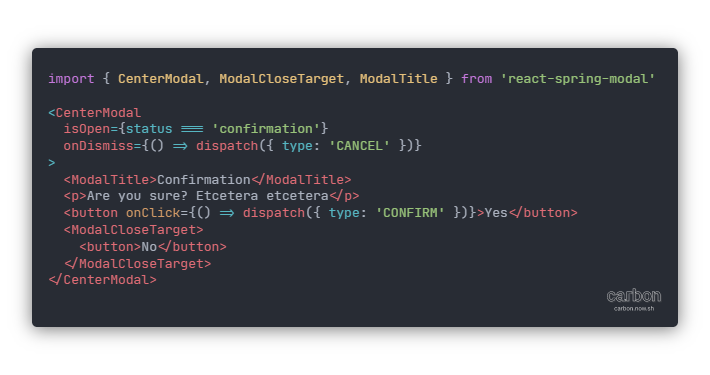

# react-spring-modal

A component library for animatable and accessible modals built with react-spring. Built to be composable to create any transition that matches your needs.

✅ Supports SSR
<br>
✅ Handles focus restoration
<br>
✅ Prevents focus on covered content
<br>
✅ Handles other modal accessibility issues as well (i.e. nested modals, initial focus, and focus restoration)
<br>
✅ Animatable via `react-spring`'s `useTransition`

## Usage

<!-- TODO: replace with Carbon.now.sh screenshot and add Alt text -->



### Installation

When you install `react-spring-modal` you'll need to make sure that you have also installed `react`, `react-dom` and `react-spring`.

Note: this package uses React's hooks feature, so you'll need to have at least `react@16.8.0` or up.

```bash
yarn add react-spring-modal react react-dom react-spring

# or

npm i react-spring-modal react react-dom react-spring
```

### Example

<!-- TODO: update example after publishing -->

You can [view comprehensive live examples on CodeSandbox.io](https://codesandbox.io/embed/react-spring-modalall-b3wp2?fontsize=14&hidenavigation=1&theme=dark)

To use this package you'll need to choose a modal and import the CSS file. In our example, we'll be using `<BottomModal>` to animate it's HTML contents up from the bottom of the screen with a white background.

By default, this library supports dark mode via a `.dark-mode` CSS class — you're not obligated to use any styles from this library.

```typescript jsx
import * as React from 'react';
import { BottomModal, ModalTitle, ModalCloseTarget } from 'react-spring-modal';
import 'react-spring-modal/dist/modern/styles.css';

/**
 * Renders a white modal that slides up from the bottom and back down when leaving.
 *
 * Has a built-in max-width for larger devices.
 * The max-width for smaller devices is the entire screen.
 */
export function Bottom() {
  const [isOpen, setOpen] = React.useState(false);
  return (
    <>
      <button onClick={() => setOpen(true)}>Open bottom modal</button>
      <BottomModal isOpen={isOpen} onDismiss={() => setOpen(false)}>
        {/* Defaults to <h1> and gives it an id to make it the label for your modal */}
        <ModalTitle>My Bottom Modal</ModalTitle>
        <p>Lorem ipsum dolor sit amet.</p>

        {/* Automatically adds onClick that dismisses modal */}
        <ModalCloseTarget>
          <button>Close</button>
        </ModalCloseTarget>
      </BottomModal>
    </>
  );
}
```

From version 2.0.0 and on you no longer need to add a `#modal-root`. All you need to do is

You can also create your own modal with it's own transition by utilizing the component that `<CenterModal>`, `<BottomModal>`, and `<ExpandModal>` are built on — `<BaseModal>`. It takes the same arguments as the previous two but provides no built in positioning or animation (besides the overlay fading in). Here is an example of creating your own animated modal:

```typescript jsx
import * as React from 'react';
import { BaseModal, ModalTitle, ModalCloseTarget } from 'react-spring-modal';

const staticModalStyles = {
  position: 'absolute',
  top: 0,
  right: 0,
  padding: '1rem 2rem',
  borderRadius: '0.25rem'
};

/**
 * We're going to animate the background color from
 * a light red (lightcoral) to a light blue (lightcyan)
 *
 * We're also going to slide it down from the top right
 * and then back up when we close it
 */
export function Custom() {
  const [isOpen, setOpen] = React.useState(false);

  return (
    <>
      <button onClick={() => setOpen(true)}>Open custom modal</button>
      <BaseModal
        isOpen={isOpen}
        onDismiss={() => setOpen(false)}
        contentTransition={{
          from: { background: 'lightcoral', transform: 'translateY(-100%)' },
          enter: { background: 'lightcyan', transform: 'translateY(0)' },
          leave: { background: 'lightcoral', transform: 'translateY(-100%)' }
        }}
        contentProps={{ style: staticModalStyles }}
      >
        <ModalTitle>My Custom Modal</ModalTitle>
        <ModalCloseTarget>
          <button>Close</button>
        </ModalCloseTarget>
      </BaseModal>
    </>
  );
}
```

### API

#### `<BaseModal>`

For custom modals, `<BaseModal>` should be used as it handles accessibility via `@reach/dialog` which handles everything from focus locking and focus restoration to rendering non-modal content inaccessible via `aria-hidden`.

```typescript
interface BaseModalProps {
  // Used to determine open and closed state for useTransition internally
  isOpen: boolean;

  // Used to close the modal when clicking on the backdrop, pressing Escape, or clicking on a <ModalCloseTarget> child.
  onDismiss?: (event?: React.SyntheticEvent) => void;
  children: ReactNode;

  // Allows you to disable focus lock with a boolean.
  dangerouslyBypassFocusLock?: boolean;

  // All props allowed by animated(DialogOverlay) and all HTML attributes.
  overlayProps?: OverlayProps;

  // initial, from, enter, and leave from react-spring's useTransition.
  overlayTransition?: ModalTransition;

  // The same thing but with animated(DialogContent).
  contentProps?: ContentProps;
  contentTransition?: ModalTransition;

  // Everything that isn't included in the ModalTransition from react-spring's useTranistion.
  transitionConfig?: Omit<CssTransitionProps, 'initial' | 'from' | 'enter' | 'leave'>;

  // A custom label id for the modal's aria-labelledby attribute
  labelId?: string;
}

type CssTransitionProps = UseTransitionProps<boolean, CSSProperties>;
interface ModalTransition {
  initial?: CssTransitionProps['initial'];
  from?: CssTransitionProps['from'];
  enter?: CssTransitionProps['enter'];
  leave?: CssTransitionProps['leave'];
}
```

<!-- TODO: Add links -->

You can find information about [`UseTransitionProps` type definition here]() and [information about `DialogOverlay` and `DialogContent` here]().

#### `<BottomModal>`, `<CenterModal>`, and `<ExpandModal>`

Built-in custom modals.

- `<BottomModal>` slides in from the bottom of the screen and stays attached to the bottom.
- `<CenterModal>` fades in and is positioned in the center.

Both of the above share all props with `<BaseModal>`.

- `<ExpandModal>` expands from the specified coordinates in a circle shape via the CSS property `clip-path`.

```typescript
interface ExpandModalProps extends BaseModalProps {
  // x and y are percentages
  x?: number;
  y?: number;
}
```

#### `<ModalTitle>`

```typescript
interface ModalTitleProps extends HTMLAttributes<Element> {
  as?: ComponentType | keyof JSX.IntrinsicElements;
  children: ReactNode;
}
```

This component simply acts as an `<h1>` by default and gives it an `id` from context that allows it to be used as the label for your modal. It doesn't have to be an `<h1>` but, if focus lock is on, it is highly recommended that it stays an `<h1>`.

#### `<ModalCloseTarget>`

```typescript
interface ModalCloseTargetProps {
  children: ReactNode;
}
```

This component simply assigns `onClick` on your `children` to the value of `onDismiss` from your modal. This way you won't need to rewrite your `onDismiss` function multiple times.

## FAQ

<!-- TODO: answer this question -->

- How do I prevent the modal from automatically focusing on the first focusable element once my modal has opened?

  In order to do this, you will have to `dangerouslyBypassFocusLock` and then use `react-focus-lock` and `react-remove-scroll` to reimplement [the existing code in the `@reach/dialog` package](https://github.com/reach/reach-ui/blob/e1a6fba7042e1e023c4a3a4e7c15a13225500667/packages/dialog/src/index.tsx#L184-L213) to disable `autoFocus`.

## License

License MIT © [Christopher H. Brown](https://github.com/ChrisBrownie55)
